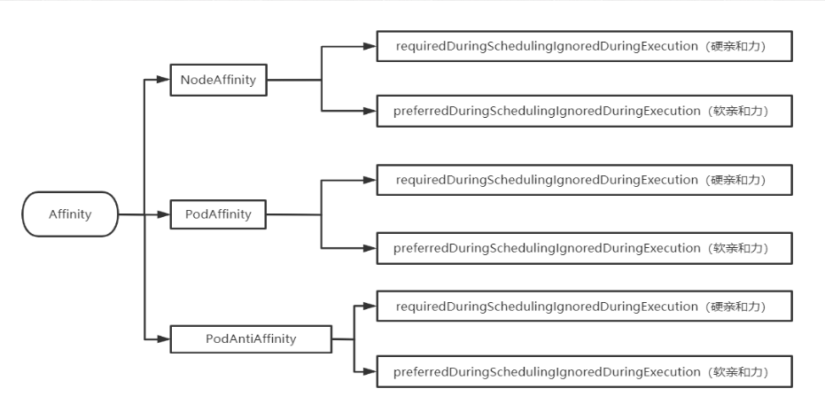
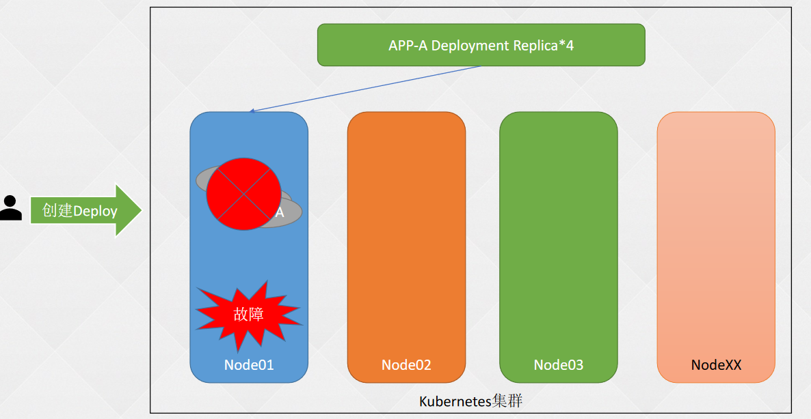
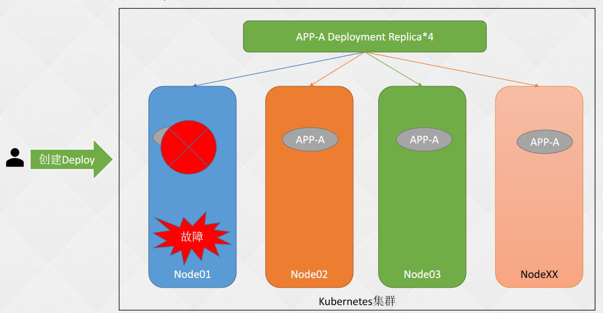
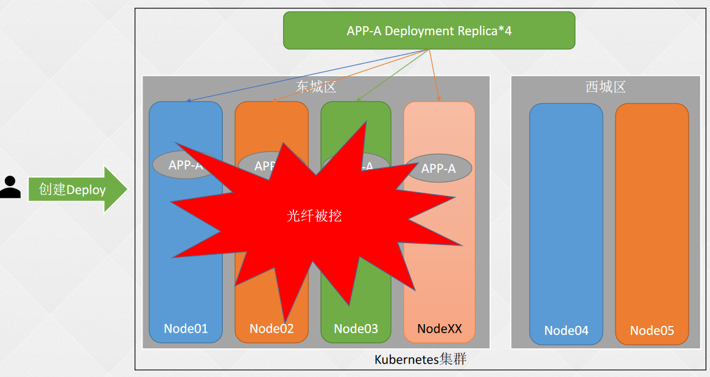
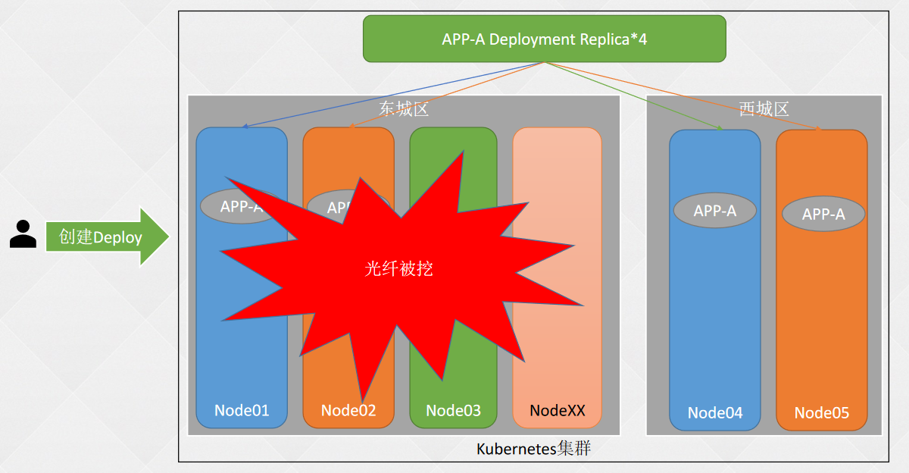
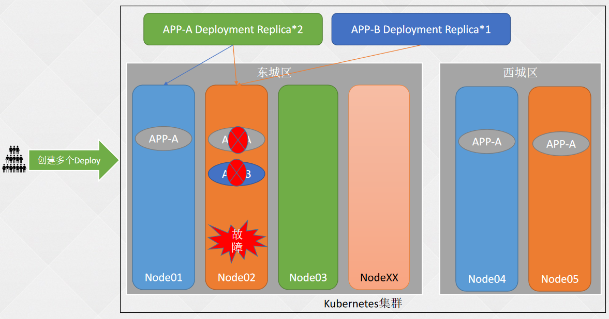
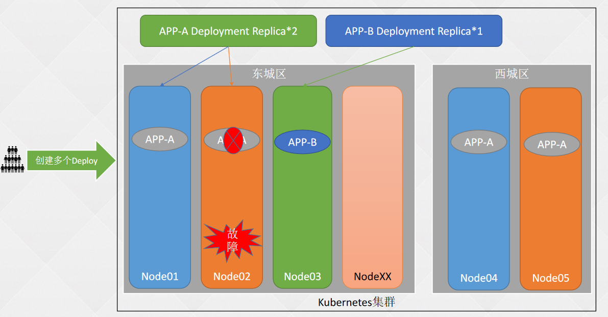

## 我们仍然存在的问题

###  Pod和节点之间的关系

- 某些Pod优先选择有ssd=true标签的节点，如果没有在考虑部署到其它节点；
- 某些Pod需要部署在ssd=true和type=physical的节点上，但是优先部署在ssd=true的节点上；

###  Pod和Pod之间的关系
- 同一个应用的Pod不同的副本或者同一个项目的应用尽量或必须不部署在同一个节点或者符合某个标签的一类节点上或者不同的区域；
- 相互依赖的两个Pod尽量或必须部署在同一个节点上或者同一个域内

### 分类
Affinity亲和力：
NodeAffinity：节点亲和力/反亲和力
PodAffinity：Pod亲和力
PodAntiAffinity：Pod反亲和力


## Affinity分类



## 提高可用率--部署至不同宿主机

原有架构： 所有副本都在一个节点上

问题： 节点掉线

解决方法： 分散到多个节点



使用pod反亲和力分散到每个节点




## 提高可用率--部署至不同机房/机柜

问题是： 机房光纤被挖

解决方法： 分散到不同机房







## 提高可用率—不放在同一个篮子里

默认俩应用可能恰好在同一台主机

不同应用放到不同的主机






## 节点亲和力配置详解

➢ requiredDuringSchedulingIgnoredDuringExecution：硬亲和力配置
◼ nodeSelectorTerms：节点选择器配置，可以配置多个matchExpressions（满足其一），每个
matchExpressions下可以配置多个key、value类型的选择器（都需要满足），其中values可以配置多个
（满足其一）
➢ preferredDuringSchedulingIgnoredDuringExecution：软亲和力配置
◼ weight：软亲和力的权重，权重越高优先级越大，范围1-100
◼ preference：软亲和力配置项，和weight同级，可以配置多个，matchExpressions和硬亲和力一致
➢ operator：标签匹配的方式
◼ In：相当于key = value的形式
◼ NotIn：相当于key != value的形式
◼ Exists：节点存在label的key为指定的值即可，不能配置values字段
◼ DoesNotExist：节点不存在label的key为指定的值即可，不能配置values字段
◼ Gt：大于value指定的值
◼ Lt：小于value指定的值


## Pod亲和力和反亲和力详解

➢ labelSelector：Pod选择器配置，可以配置多个
➢ matchExpressions：和节点亲和力配置一致
➢ operator：配置和节点亲和力一致，但是没有Gt和Lt
➢ topologyKey：匹配的拓扑域的key，也就是节点上label的key，key和
value相同的为同一个域，可以用于标注不同的机房和地区
➢ Namespaces: 和哪个命名空间的Pod进行匹配，为空为当前命名空间


## 示例1：同一个应用部署在不同的宿主机

➢ labelSelector：Pod选择器配置，可以配置多个
➢ matchExpressions：和节点亲和力配置一致
➢ operator：配置和节点亲和力一致，但是没有Gt和Lt
➢ topologyKey：匹配的拓扑域的key，也就是节点上label的key，key和
value相同的为同一个域，可以用于标注不同的机房和地区

```yaml
apiVersion: apps/v1
kind: Deployment
metadata:
  creationTimestamp: null
  labels:
    app: must-be-diff-nodes
  name: must-be-diff-nodes
  namespace: kube-public
spec:
  replicas: 3
  selector:
    matchLabels:
      app: must-be-diff-nodes
  strategy: {}
  template:
    metadata:
      creationTimestamp: null
      labels:
        app: must-be-diff-nodes
    spec:
      affinity:
        podAntiAffinity:
          requiredDuringSchedulingIgnoredDuringExecution:
          - labelSelector:  # Pod选择器配置，可以配置多个
              matchExpressions:  # 和节点亲和力一致
              - key: app
                operator: In
                values:
                - must-be-diff-nodes
            topologyKey: kubernetes.io/hostname
      containers:
      - image: nginx
        name: nginx
        ports:
        - containerPort: 80
        resources: {}

```


## 示例2：同一个应用不同副本固定节点

```yaml
apiVersion: apps/v1
kind: Deployment
metadata:
  creationTimestamp: null
  labels:
    app: redis-cache
  name: redis-cache
spec:
  replicas: 5
  selector:
    matchLabels:
      app: redis-cache
  strategy: {}
  template:
    metadata:
      creationTimestamp: null
      labels:
        app: redis-cache
    spec:
      nodeSelector:
        app: redis-cache
      affinity:
        podAntiAffinity:
          requiredDuringSchedulingIgnoredDuringExecution:
          - labelSelector:  # Pod选择器配置，可以配置多个
              matchExpressions:  # 和节点亲和力一致
              - key: app
                operator: In
                values:
                - redis-cache
            topologyKey: kubernetes.io/hostname
      containers:
      - image: redis:3.2-alpine
        name: redis
        resources: {}
status: {}

```

## 示例3：应用和缓存尽量部署在同一个域内

```yaml
# 同一个应用不同副本固定节点
apiVersion: apps/v1
kind: Deployment
metadata:
  creationTimestamp: null
  labels:
    app: redis-cache
  name: redis-cache
spec:
  replicas: 3
  selector:
    matchLabels:
      app: redis-cache
  strategy: {}
  template:
    metadata:
      creationTimestamp: null
      labels:
        app: redis-cache
    spec:
      # nodeSelector:
      #   app: redis-cache
      affinity:
        podAntiAffinity:
          requiredDuringSchedulingIgnoredDuringExecution:
          - labelSelector:  # Pod选择器配置，可以配置多个
              matchExpressions:  # 和节点亲和力一致
              - key: app
                operator: In
                values:
                - redis-cache
            topologyKey: kubernetes.io/hostname
      containers:
      - image: redis:3.2-alpine
        name: redis
        resources: {}
status: {}
# 应用和缓存尽量部署在同一个域内
apiVersion: apps/v1
kind: Deployment
metadata:
  creationTimestamp: null
  labels:
    app: web-server
  name: web-server
spec:
  replicas: 3
  selector:
    matchLabels:
      app: web-server
  strategy: {}
  template:
    metadata:
      creationTimestamp: null
      labels:
        app: web-server
    spec:
      affinity:
        podAntiAffinity:
          requiredDuringSchedulingIgnoredDuringExecution:
          - labelSelector:  # Pod选择器配置，可以配置多个
              matchExpressions:  # 和节点亲和力一致
              - key: app
                operator: In
                values:
                - web-server
            topologyKey: kubernetes.io/hostname
        podAffinity:
          preferredDuringSchedulingIgnoredDuringExecution:
          - weight: 100
            podAffinityTerm:
              labelSelector:
                matchExpressions:
                - key: app
                  operator: In
                  values:
                  - redis-cache
              topologyKey: kubernetes.io/hostname
      containers:
      - image: nginx:1.16-alpine
        name: nginx
        resources: {}
status: {}


```


## 示例4：同一个应用多区域部署	

```yaml
apiVersion: apps/v1
kind: Deployment
metadata:
  creationTimestamp: null
  labels:
    app: must-be-diff-zone
  name: must-be-diff-zone
spec:
  replicas: 3
  selector:
    matchLabels:
      app: must-be-diff-zone
  strategy: {}
  template:
    metadata:
      creationTimestamp: null
      labels:
        app: must-be-diff-zone
    spec:
      affinity:
        podAntiAffinity:
          requiredDuringSchedulingIgnoredDuringExecution:
          - labelSelector:  # Pod选择器配置，可以配置多个
              matchExpressions:  # 和节点亲和力一致
              - key: app
                operator: In
                values:
                - must-be-diff-zone
            topologyKey: region
      containers:
      - image: nginx
        name: nginx
        resources: {}
status: {}

```


## 拓扑域TopologyKey详解

topologyKey：拓扑域，主要针对宿主机，相当于对宿主机进行区域的划分。用label进行判断，不同的key和不同的value是属于不同的拓扑域


## 示例5：同一个应用多区域部署
